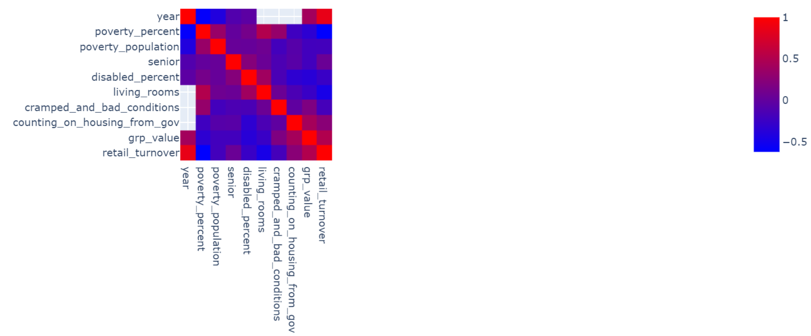
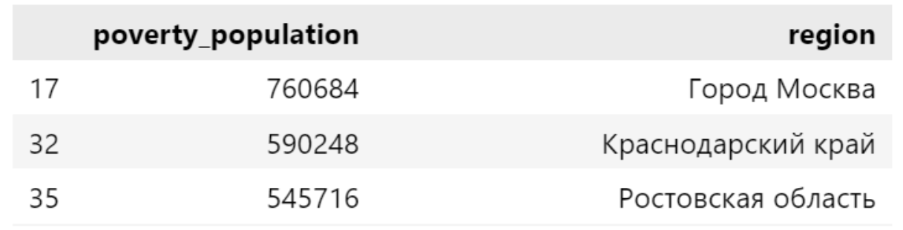
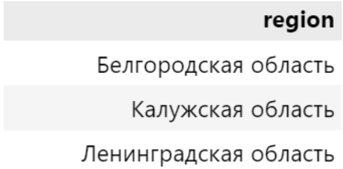

# 
Определение уязвимых групп населения

## Оглавление  
[1. Описание проекта](.README.md#Описание-проекта)  
[2. Краткая информация о данных](.README.md#Краткая-информация-о-данных)  
[3. Этапы работы над проектом](.README.md#Этапы-работы-над-проектом)    
[4. Выводы](.README.md#Выводы) 

### Описание проекта  

 Согласно опросу «инФОМ» от декабря 2021 года, у 27% россиян хватает денег только на еду, а ещё 9% не могут позволить себе полноценное питание.Эти люди особенно внимательно следят за ценами, а темп роста  цен на продукты обычно превышает средний темп инфляции. При этом Росстат считает, что расходы на продукты питания должны составлять примерно 36% от среднемесячных расходов россиянина (ещё около 10% приходится на услуги ЖКХ и жильё, 4 % — на лекарства). 

 До 2021 года «черта бедности» (жизнь на сумму ниже прожиточного минимума) в России определялась стоимостью минимальной продуктовой корзины.в том же году правительство «отвязало» уровень бедности от цен на базовые продукты: с 2021 года прожиточный минимум рассчитывается как 44.2 % от медианного дохода граждан РФ за прошлый год. В распоряжении есть данные о доходах, заболеваемости, социально незащищённых слоях населения России и другие экономические и демографические данные.

 **Задача:**
  
  ➔ кластеризовать регионы Россиии определить, какие из них наиболее остро нуждаются в помощи малообеспеченным/неблагополучным слоям населения;

  ➔ описать группы населения, сталкивающиеся с бедностью;

  ➔ определить:
  
   - влияет ли число детей, пенсионеров и других социально уязвимых групп на уровень социального благополучия в регионе;
    
   - связан ли уровень социального благополучия с производством и потреблением в регионе;
    
   - какие ещё зависимости можно наблюдать относительно социально незащищённых слоёв населения.

:arrow_up:[к оглавлению](_)

### Краткая информация о данных

Онлайн-школой SkillFactory из открытых источников интернета были предоставлены такие данные, как

➔ Численность населения с доходами ниже величины прожиточного
минимума, в процентах от общей численности населения.
➔ Численность инвалидов по возрастным группам в разрезе субъектов
РФ.
➔ Распределение малоимущего населения по
социально-демографическим группам.
➔ Комплексное наблюдение условий жизни населения в 2020 году.
➔ Социальное положение и уровень жизни населения России в 2021
году.
➔ Численность постоянного населения на 1 января.
➔ Оборот розничной торговли на душу населения с 2000 г.
➔ и другие, не примененные в данной работе

  
:arrow_up:[к оглавлению](.README.md#Оглавление)

### Этапы работы над проектом  

* Этап 1: Анализ и отчистка данных. Разведывательный анализ (EDA);

* Этап 2: Разработка ML-модели. Описание и анализ кластеров;

* Этап 3: На DockerHub опубликован образ веб-сервиса, предсказывающего кластер региона по набору данных [процент бедности, число малоимущих, социальное неблагополучие] (см cluster_df)
https://hub.docker.com/repository/docker/vspavlov/identification_of_vulnerable_populations_sf_final_project/general

:arrow_up:[к оглавлению](.README.md#Оглавление)

### Выводы

#### Проведен разведывательный анализ данных, найдены зависимости, такие как

В среднем, после 2000 года каждый год относительные и абсолютные значения бедности уменьшаются, а экономические показатели растут
В малообеспеченных регионах:
* хуже жилищные условия
* хуже экономические показатели

#### Проведена кластеризация регионов

Определены кластеры регионов, которые наиболее остро нуждаются в помощи малообеспеченным/неблагополучным слоям населения
* Наибольшее относительное число малообеспеченных

* Наибольшее абсолютное число малообеспеченных

* Выше социальные трудности в регионах:

#### Определение кластеров регионов подтверждено статистическими методами